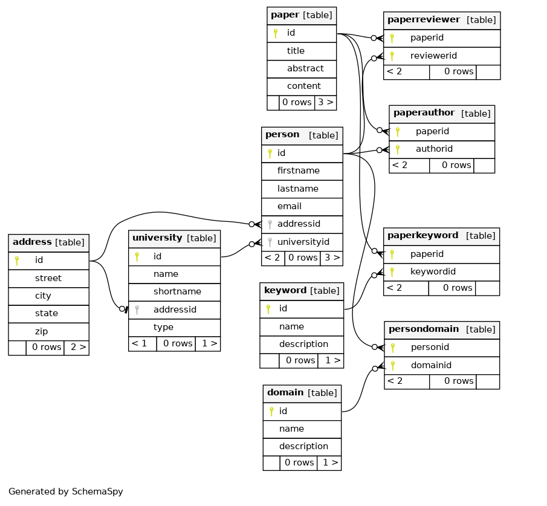

# AI Conference

This project is might be used by a conference-like organization that collects academic papers such as Arxiv or IEEE. This includes the papers, authors, reviewers, keywords, and universities.



## Query I thought it did well on

**MODEL**: gpt-4-latest; ZERO_SHOT

### Prompt: 
>Give me the list of people associated with each domain.

### Produced Sql:
```sql
SELECT 
    d.name AS domain_name,
    p.firstName AS person_first_name,
    p.lastName AS person_last_name,
    p.email AS person_email
FROM 
    ai.PersonDomain pd
JOIN 
    ai.Person p ON pd.personId = p.id
JOIN 
    ai.Domain d ON pd.domainId = d.id;
```
### Resulting Rows:
```json
[
  { "domain_name": "math", "person_first_name": "Carl", "person_last_name": "Junior", "person_email": "carl.junior@gmail.com" },
  { "domain_name": "human-computer interaction", "person_first_name": "Carl", "person_last_name": "Junior", "person_email": "carl.junior@gmail.com" },
  { "domain_name": "physics", "person_first_name": "May", "person_last_name": "Rain", "person_email": "may.rain@hotmail.com"},
  { "domain_name": "math", "person_first_name": "May", "person_last_name": "Rain", "person_email": "may.rain@hotmail.com" },
  // ...
]
```

### Open Ai's Translation:
>Here is the list of people associated with each domain:
>
>1. **Domain: Math**
>    - Carl Junior (carl.junior@gmail.com)
>    - May Rain (may.rain@hotmail.com)
>    - Dok Peh (electric.sheep@novel.org)
>    - Bob Torln (vacant@my.mind)
>
>2. **Domain: Human-Computer Interaction**
>    - Carl Junior (carl.junior@gmail.com)
>    - May Rain (may.rain@hotmail.com)
>    - Bob Torln (vacant@my.mind)
>
>3. **Domain: Physics**
>    - May Rain (may.rain@hotmail.com)
>    - Gottfried Friedhof (world.peace@loco.jam)
>
>4. **Domain: Computer Security**
>    - Dok Peh (electric.sheep@novel.org)
>
>5. **Domain: Computational Theory**
>    - Yolanda Garber (spin.doctors@bored.game)
>    - Gottfried Friedhof (world.peace@loco.jam)
>

### Discussion

The model was able to produce the right answer in a very human-readable format. It's interesting to that the sql that the model chose would still produce very raw results with little formatting or grouping. It chose to query the database for all information and handle the formatting and grouping itself showing that the model is able to perform more complex tasks.

## Question that it tripped up on

**MODEL**: gpt-4-latest; MULTI_SHOT

### Prompt: 
>What are possible additional reviewers for the Cats paper where reviewers can't come from the same universities as the authors?

### Produced Sql:
```sql
SELECT DISTINCT p.firstName, p.lastName, p.email
FROM ai.Person p
JOIN ai.PersonDomain pd ON p.id = pd.personId
LEFT JOIN ai.PaperReviewer pr ON p.id = pr.reviewerId
JOIN ai.PaperAuthor pa ON pa.authorId = p.id
LEFT JOIN ai.Paper pp ON pr.paperId = pp.id
JOIN ai.University ur ON p.universityId = ur.id
WHERE pp.title = 'Cats'
AND p.universityId NOT IN (
    SELECT DISTINCT a.universityId
    FROM ai.Person a
    JOIN ai.PaperAuthor pa ON a.id authorId pa.paperId.Execute fields filter only.
```
### Result:
```yaml
length: 98
name: error
severity: ERROR
code: "42601"
position: "447"
file: scan.l
line: "1176"
routine: scanner_yyerror
```

### Discussion

The model seems to gave completely forgotten that it was writing sql and started writing something else. I believe that the complexity of the prompt may have given it problems or maybe the phrasing took creativity to translate to SQL.

## Other examples

To view other examples of queries, click [here](./cleaned-sample.yaml). This file includes prompt, sql, and result for 6 queries each for 3 different strategies.

## Prompting Strategies

This project involved trying three different prompting strategies: 1) `zero_shot`, 2) `one_shot`, 3) `multi_shot`. Each of the strategies build of a last one according to the order given. The basic `zero_shot` gave developer command that informed the assistant with format to be used (what the user would be asking) and provided the sql which built the tables in the database. When asking for sql, it would preface the user's prompt with "PRODUCE_SQL:" and for translating result it would preface the results with "GIVE_RESULTS:". The `single_shot` strategy add to this by adding a single example of an in-domain prompt and result in the developer commands while The `multi_shot` strategy gives two examples.

In general the strategies performed similarly. The most different was observed in the `zero_shot` strategy compared to the others. In general, the zero_shot results tended to be more expressive and detailed, for example, when asked "What papers have been written by researchers without a university", it gave the title and a summary of the paper in question, while the other strategy resulted in just the title. This is likely because the model sought to mimic the language of the examples in the single- and multi shot strategies.

It would also appear that the `multi_shot` strategy is more unstable although further testing would be required to confirm this. I suspect this is due to the length of the examples diluting the attention paid to the instructions by the model. 

## Conclusion

Although the experimentation was pretty superficial, the result of this project showed that the GPT 4 model can successfully be used to produce natural language results from a natural language. The results also show that the model can do extra processing such as summary or interpretation of data returned from the database. Despite this, the model was shown to sometimes fail or forget its task likely due to complex queries or long instructions. 

While the model has the potential to be powerful, more improvement may need to be made such as better prompt engineering and exploration of different strategies.